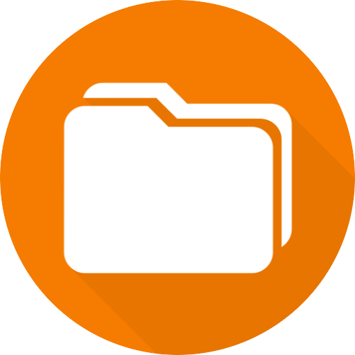
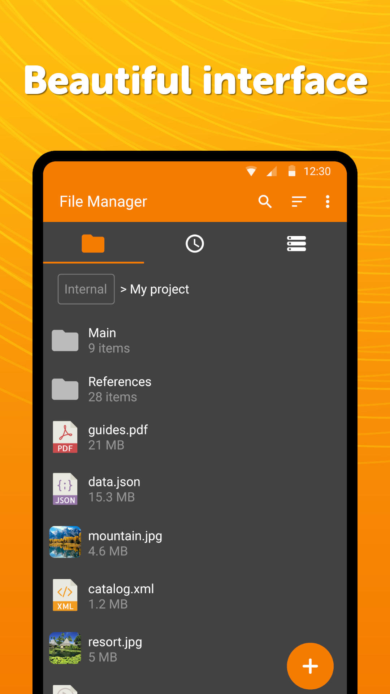
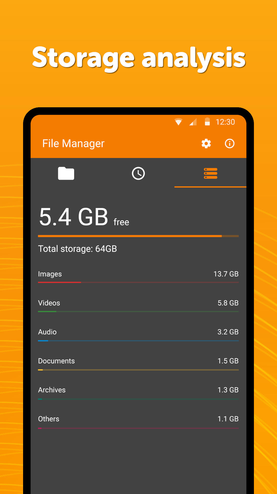

# Simple File Manager

A lightweight quick file manager for everyday use. It offers a userful search functionality, you can also customize the home folder and select favorite folders for quick access.

The app contains multiple powerful security related functions, like password protecting hidden items, deleting files, or the whole app. You can choose between using a pattern, pin, or a fingerprint to keep your data private.

This modern file organizer supports fast browsing of root files, SD cards and USB devices.

To keep your productive, it obviously has all the standard file operations like rename, copy, move, delete, share etc. It can also be used for saving up some storage, since it allows compressing and decompressing too. You can easily create new files or folders if you wish so.

You can obviously select sorting by multiple different values, toggle between ascending and descending, or use a folder specific sorting.

By just a few clicks you can also check file or folder properties, which shows various fields like the file size, date of the last modification, or EXIF values like the creation date, camera model at photos etc.

To get a file or folders path quickly, you can easily select it by long pressing and copying it in the clipboard.

You can create handy desktop shortcuts for accessing your favorite items quickly.

It contains a light file editor that you can use either for printing documents, editing them, or read easily with using zoom gestures, whenever needed.

It comes with material design and dark theme by default, provides great user experience for easy usage. The lack of internet access gives you more privacy, security and stability than other apps.

Contains no ads or unnecessary permissions. It is fully opensource, provides customizable colors.

Check out the full suite of Simple Tools here:  
https://www.simplemobiletools.com

Standalone website of Simple File Manager Pro:  
https://www.simplemobiletools.com/filemanager

Facebook:  
https://www.facebook.com/simplemobiletools

Reddit:  
https://www.reddit.com/r/SimpleMobileTools

